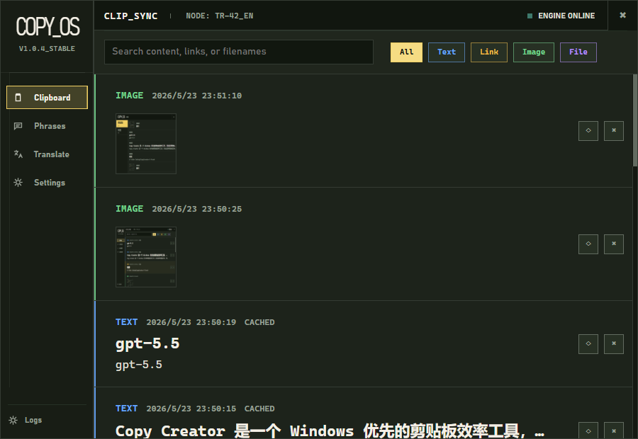
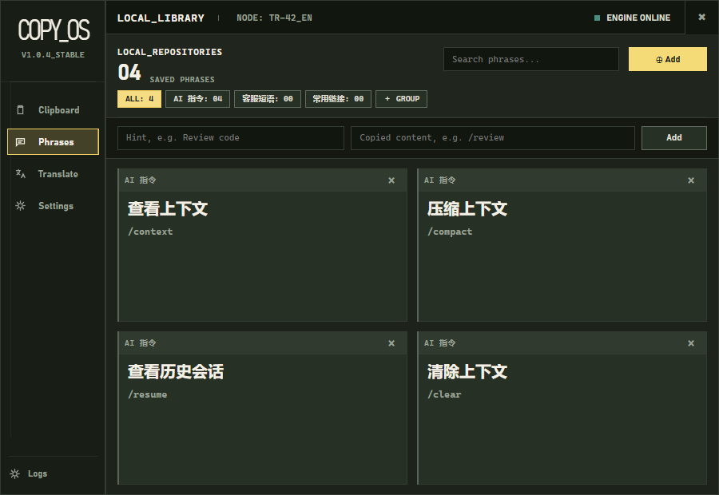
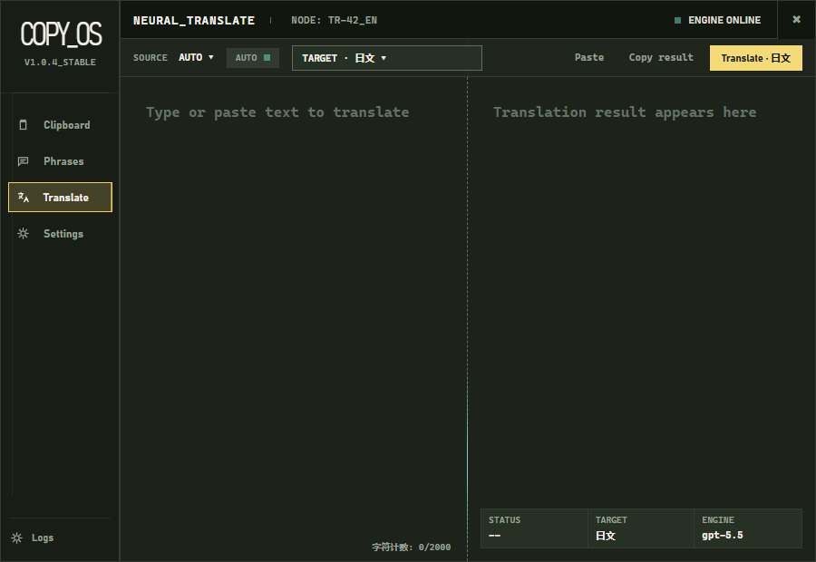
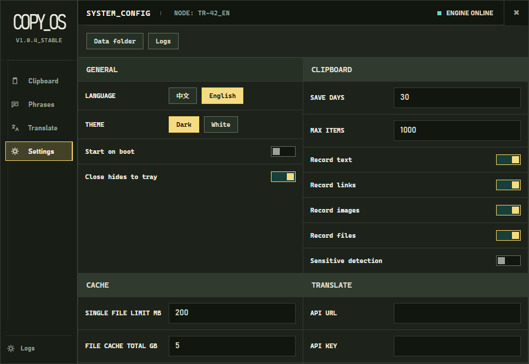
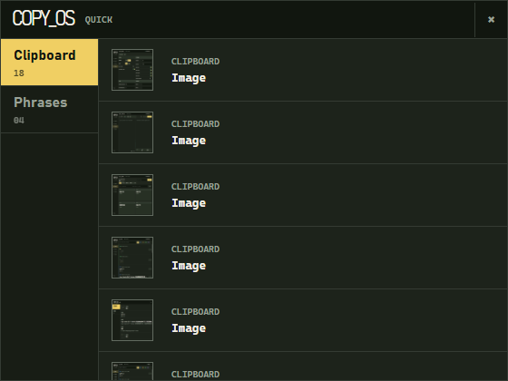

# Copy Creator

[简体中文](README.zh-CN.md)

Copy Creator is a Windows-first clipboard productivity app. It combines clipboard history, reusable phrases, translation, quick access, and local settings into a compact desktop tool.

> Project status: early desktop build. The current runnable Windows app is the WinForms/WebView2 shell in `desktop/`. The `src-tauri/` folder is kept as an experimental Tauri 2 scaffold.

## Features

- Clipboard history for text, links, images, and files.
- Reusable phrase groups for commands, customer replies, links, and personal snippets.
- Translation panel with OpenAI-compatible API configuration.
- Quick panel for fast clipboard and phrase access.
- Local-first data storage next to the executable.
- Light/dark themes, density settings, and Chinese/English UI text.
- Windows tray behavior and hide-on-close desktop workflow.

## Screenshots

Copy Creator is built around a compact desktop workflow: keep recent clipboard items searchable, turn repeated text into reusable phrases, translate short content, and keep everyday copy/paste actions close to the Windows tray.











## Tech Stack

- Frontend preview: React, Vite, TypeScript.
- Desktop runtime: .NET 9 Windows Forms, WebView2.
- Experimental desktop scaffold: Tauri 2 and Rust.

## Requirements

- Windows 10/11.
- Node.js 20 or newer.
- .NET SDK 9.x.
- Microsoft Edge WebView2 Runtime.

## Development

Install frontend dependencies:

```powershell
npm install
```

Run the browser preview:

```powershell
npm run dev
```

Build the frontend:

```powershell
npm run build
```

Publish the Windows desktop app:

```powershell
dotnet publish .\desktop\CopyCreator.WinForms.csproj -c Release -r win-x64 --self-contained true /p:PublishSingleFile=true /p:EnableCompressionInSingleFile=true -o .\release
```

## Repository Layout

```text
desktop/      Windows Forms + WebView2 desktop app
src/          React/Vite browser preview UI
src-tauri/    Experimental Tauri 2 scaffold
docs/         Project docs and publishing guides
.github/      GitHub issue, PR, and workflow files
```

## Release Notes

See [CHANGELOG.md](CHANGELOG.md).

## Security

See [SECURITY.md](SECURITY.md) and [PRIVACY.md](PRIVACY.md).
