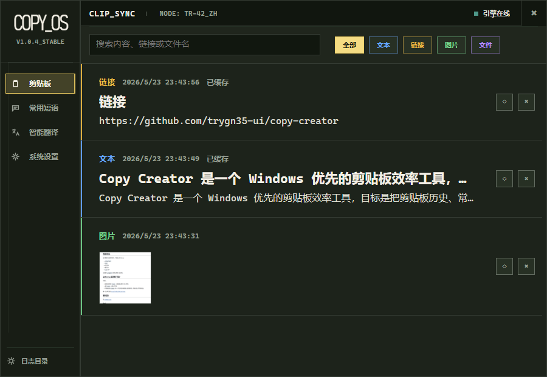
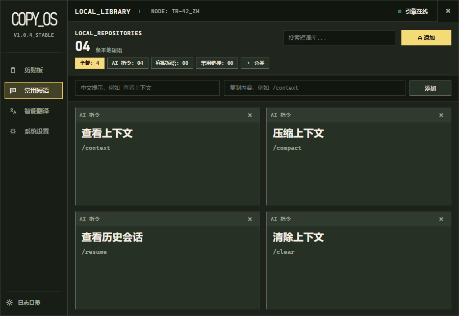
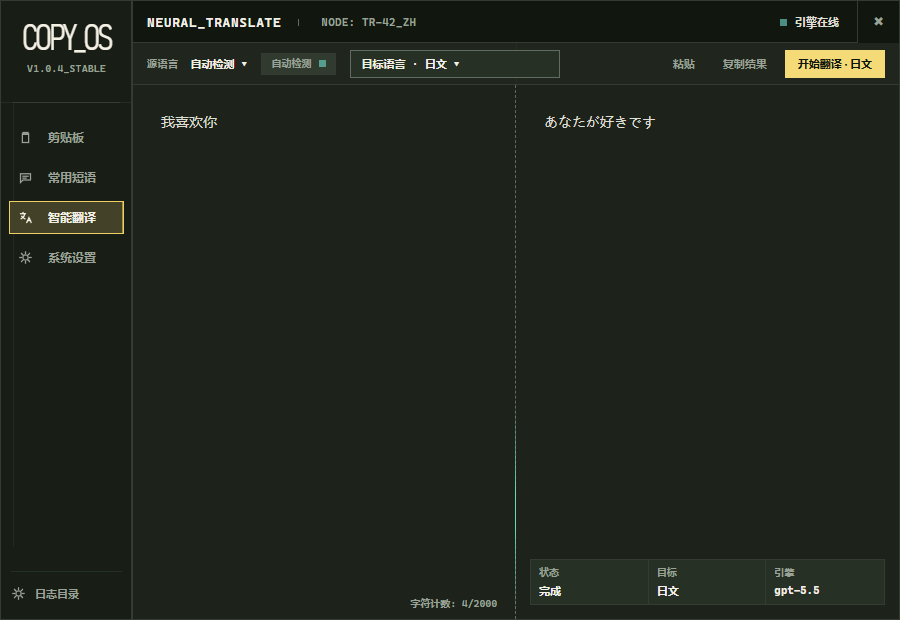
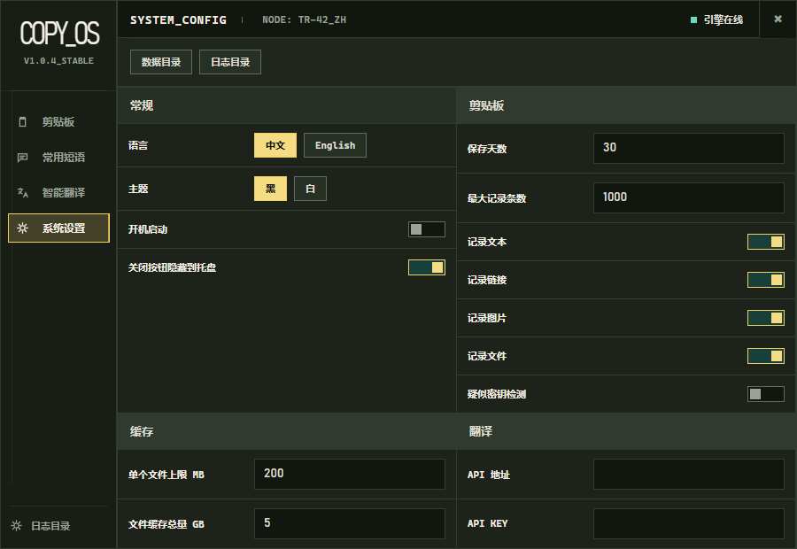
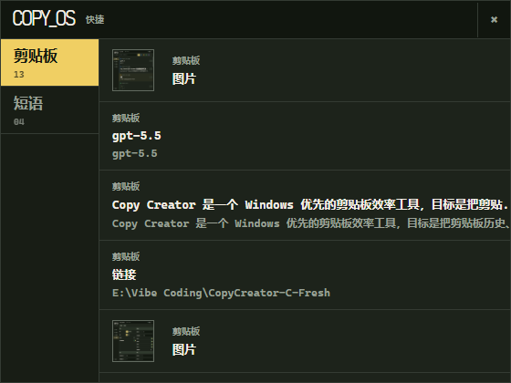

# Copy OS

[English](README.md)

Copy OS 是一个 Windows 剪贴板管理、常用短语和快捷粘贴工具，目标是把剪贴板历史、可复用短语、轻量翻译、快捷呼出和本地设置集中到一个紧凑桌面工作流里。

> 当前状态：早期桌面版。现在真正可运行的 Windows 程序在 `desktop/`，使用 WinForms + WebView2。`src-tauri/` 暂时保留为 Tauri 2 实验骨架。

## 功能

- 记录文本、链接、图片、文件类型的剪贴板历史。
- 管理常用短语分组，例如 AI 指令、客服回复、常用链接和个人片段。
- 提供翻译面板，支持配置 OpenAI 兼容接口。
- 提供快捷面板，快速复制剪贴板内容和常用短语。
- 数据默认保存在程序同级本地目录。
- 支持浅色/深色、列表密度、中英文界面。
- 支持 Windows 托盘、关闭隐藏等桌面使用习惯。

## 截图

Copy OS 围绕日常复制粘贴工作设计：让最近复制过的内容可搜索，让重复输入变成可复用短语，支持短文本翻译，并把快捷粘贴面板放在靠近 Windows 托盘的位置。











## 技术栈

- 前端预览：React、Vite、TypeScript。
- 桌面运行：.NET 9 Windows Forms、WebView2。
- 实验骨架：Tauri 2、Rust。

## 环境要求

- Windows 10/11。
- Node.js 20 或更高版本。
- .NET SDK 9.x。
- Microsoft Edge WebView2 Runtime。

## 本地开发

安装前端依赖：

```powershell
npm install
```

运行浏览器预览：

```powershell
npm run dev
```

构建前端：

```powershell
npm run build
```

发布 Windows 桌面程序：

```powershell
dotnet publish .\desktop\CopyCreator.WinForms.csproj -c Release -r win-x64 --self-contained true /p:PublishSingleFile=true /p:EnableCompressionInSingleFile=true -o .\release
```

## 目录结构

```text
desktop/      WinForms + WebView2 桌面程序
src/          React/Vite 浏览器预览界面
src-tauri/    Tauri 2 实验骨架
docs/         项目文档和上传指南
.github/      GitHub Issue、PR 和 CI 配置
```

## 更新记录

见 [CHANGELOG.md](CHANGELOG.md)。

## 安全

更多说明见 [SECURITY.md](SECURITY.md) 和 [PRIVACY.md](PRIVACY.md)。
